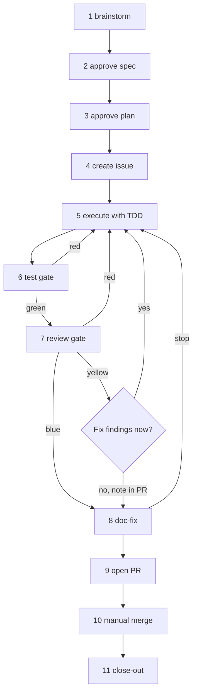

# Skills

AI coding-agent plugins published from this repository. The `dev-flow` plugin supports Claude Code and Codex through host-specific metadata and workflow entry points, with shared standalone skills.

## Install and start

### Claude Code

```sh
/plugin marketplace add vincy-cheng/skills
/plugin install dev-flow@vincy-skills
```

Or install directly from GitHub:

```sh
claude plugin install https://github.com/vincy-cheng/skills.git
```

Start a feature or fix with `/new-feature <your idea>`. Run `/new-feature` without a new brief to resume the latest active run. The workflow uses the `gh` CLI to create GitHub issues and pull requests.

The plugin also provides `/new-idea` for documenting an idea before building it.

### Codex

Add the marketplace from GitHub:

```sh
codex plugin marketplace add vincy-cheng/skills
```

In Codex, open the **Plugins Directory**, select **Vincy Skills (Codex)**, and install `dev-flow`. Restart the Codex desktop app after installation. Invoke `$dev-flow:new-feature` with a brief to start, or without a new brief to resume the latest active run.

For a local checkout, add the marketplace from the repository root:

```sh
codex plugin marketplace add .
```

After updating a local checkout, refresh it with `codex plugin marketplace upgrade vincy-skills` and restart Codex.

## The `dev-flow` workflow

`dev-flow` guides a feature or fix through 11 steps in four phases:

| Phase | Steps | Work |
|-------|-------|------|
| Plan | 1–4 | Brainstorm, approve a spec, plan, create a GitHub issue |
| Build | 5 | Execute the plan with TDD and per-task commits |
| Verify | 6–8 | Test, review, and fix documentation drift |
| Ship | 9–11 | Open a pull request, merge it manually, close out the run |

The hard gate keeps steps in order. Gitignored state files and an index track each run so work can resume. Specs, plans, and state are stored under `docs/features/` and are not committed. Every workflow step uses a `dev-flow` skill; the plugin has no external plugin dependencies.



For requests spanning independent subsystems, step 1 can create an overview spec that records the sub-projects, order, dependencies, and deferred work. Each sub-project gets its own `/new-feature` run. Close-out updates the overview and prints the next run's command.

### Workflow skills

| Skill | Step | Purpose |
|-------|------|---------|
| `brainstorm` | 1 | Work through the design and write an approved spec |
| `plan` | 3 | Turn the spec into a contract-first implementation plan |
| `create-github-issue` | 4 | Draft and confirm an issue, then create a feature or fix branch from `dev` |
| `execute-tasks` | 5 | Complete planned tasks with TDD and a commit per task; inline or subagent mode |
| `tdd` | — | Test-first engine used by `execute-tasks` |
| `test` | 6 | Fresh tester subagent runs the repo's test and lint commands and scans changed tests for honesty |
| `review` | 7 | Fresh reviewer checks spec and plan coverage, obvious issues, and maintainability |
| `doc-fix` | 8 | Find and fix documentation drift caused by the run |
| `open-pr` | 9 | Open a pull request targeting `dev` and sync the issue; never merges |

These skills can also run on their own. The test skill uses each target repository's test and lint commands; this repository's suite is `bash tests/check.sh` and it has no linter.

### Standalone commands and skills

| Piece | Purpose |
|-------|---------|
| `/new-feature` command | Claude Code workflow orchestrator; starts or resumes a feature or fix |
| `new-feature` skill | Codex workflow orchestrator (`$dev-flow:new-feature`) |
| `/new-idea` command | Discuss an idea, then scaffold its research and planning documents |
| `commit` skill | Write Conventional Commit messages without AI attribution |
| `document-structure` skill | Generate or update agent-facing documentation in a target repo's `docs/agents/` |
| `whats-new` skill | Summarize recent work and check for documentation drift |

## `/new-idea`: capture an idea before building

Run `/new-idea <your idea>` in any repository. It asks whether the folder should be nested (`ideas/<project>/<slug>/`) or flat (`ideas/<slug>/`), and whether to include cost research.

By default it creates five self-contained documents: `README.md`, `research.md`, `design.md`, `plan.md`, and `tl-dr.md`. If requested, it adds `cost.md` with pricing, quotas, and limits. The plan is a milestone draft that can seed `/new-feature` later.

Before creating files, the command discusses and grills the idea, summarizes the decisions, and gets your explicit go-ahead. To build from the resulting folder, run `/new-feature ideas/<slug>`; the workflow uses the folder as its brief and links it from the GitHub issue.

## Repository guide

- `dev-flow/` — plugin commands, skills, evals, and host manifests
- `.agents/plugins/marketplace.json` — repository-local Codex plugin catalog
- `tests/check.sh` — 15 bash consistency checks; run after editing skills or commands
- `dev-flow/evals/` — behavioral evals for `brainstorm`, `plan`, and `tdd`, run manually with `claude plugin eval`
- `AGENTS.md` — repository guidance; `CLAUDE.md` links to the same file
- `docs/agents/INDEX.md` — starting point for the agent-facing architecture and dev-ops maps

## Acknowledgements

The `dev-flow` workflow and its early planning engine were inspired by [obra/superpowers](https://github.com/obra/superpowers). The plugin now provides its own skills for the workflow, and all artifacts stay under `docs/features/`.

The `tdd` skill's **seams** concept (testing at public boundaries rather than internals) comes from Kent Beck's *Test-Driven Development: By Example*, encountered through Matt Pocock's skill collections ([mattpocock-skills](https://github.com/mattpocock/skills)).

The `review` skill's clean-code pass draws on Robert C. Martin's *Clean Code*, [wojteklu's clean-code checklist](https://gist.github.com/wojteklu/73c6914cc446146b8b533c0988cf8d29), and the r/cleancode community guide; it is housed at `dev-flow/skills/review/references/clean-code.md`.
