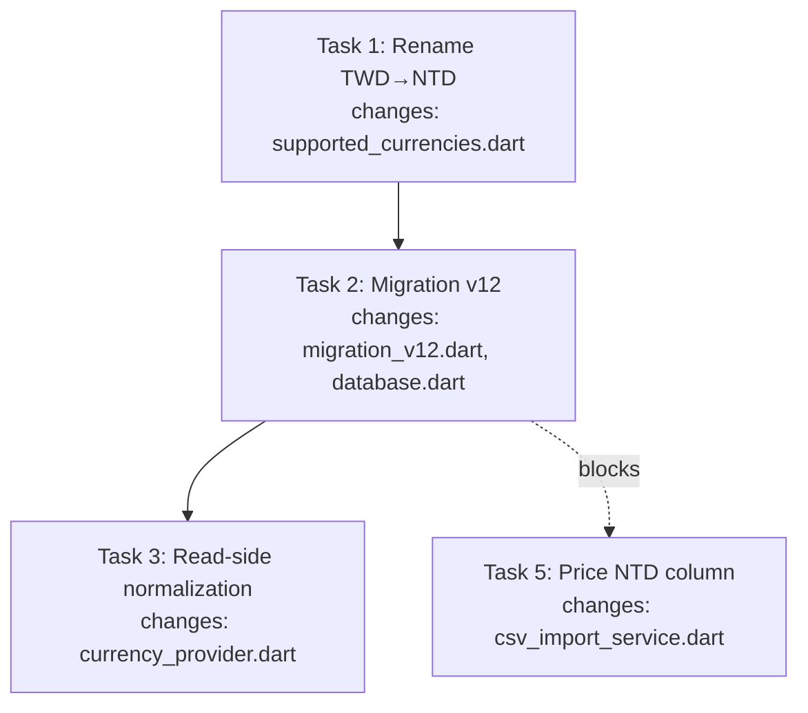

# New feature or fix — full workflow

Drive this work through all steps, in order. Do not skip steps "because it's simple" — the user wants the full pipeline every time. Works for features **and** fixes. Arguments: $ARGUMENTS.

Steps in four phases — 11 total:

```
Plan   : 1 brainstorm → 2 spec → 3 plan → 4 create issue
Build  : 5 execute (TDD)
Verify : 6 test → 7 review → 8 doc-fix
Ship   : 9 PR → 10 merge (manual) → 11 close-out
```

Run each step before the next. Pause at the natural checkpoints (after spec, after plan, after issue draft, before PR). State which step you're on as you begin it.

**Resume:** if $ARGUMENTS is empty, a feat-name, or the word "resume", go to **Resume** below and discover/continue existing work before starting anything fresh.

## Peer dependency — superpowers

Invokes `superpowers:brainstorming` and `superpowers:writing-plans` as sub-steps; runs its own `dev-flow:execute-tasks` (which invokes `dev-flow:tdd` per task), `dev-flow:test`, `dev-flow:review`, `dev-flow:doc-fix`, `dev-flow:open-pr`, `dev-flow:create-github-issue`, and `dev-flow:commit` skills. Superpowers **must** be installed for the two `superpowers:*` skills.

**Missing-superpowers check — run at the start of every step that invokes a `superpowers:*` skill (steps 1, 3):** if the skill is unavailable, **stop before doing any other work** and tell the user, in plain language:

> dev-flow needs the `superpowers` plugin for this step, but it isn't installed. Install it and retry:
> - `/plugin install superpowers` (from the official marketplace), or
> - `claude plugin install https://github.com/obra/superpowers.git`
>
> Then run `/new-feature` again — your state file is intact and you'll resume right here.

Don't dump the rest of the step or attempt a fallback. The run pauses cleanly; once superpowers is present, resume picks up from the state file's **Goal status**.

**Superpowers defaults lose to dev-flow.** Superpowers' SessionStart injection urges invoking its skills before any response, and its skills carry their own defaults (`docs/superpowers/` save paths, design-doc commits, "Execution Handoff"). Inside this workflow those defaults **do not apply**:

- Before writing any file for this run, verify the target is under `docs/features/` — never `docs/superpowers/`. If a superpowers sub-skill already wrote there, move the file (step 2 does this).
- Never commit specs, plans, or state files (see *Commit guard*). Superpowers' "commit the design document" instruction does not override this.
- A sub-skill's handoff never advances, skips, or reorders steps — see *The hard gate*.

## The hard gate

Steps 1 and 3 invoke superpowers skills with their **own** handoff instructions (brainstorming → writing-plans; writing-plans → "Execution Handoff"). Left unchecked, those handoffs **will** skip or reorder this workflow. The gate prevents it **structurally**: the state file's **Goal status** is the only thing that advances a step.

**Gate check — run at the start of every step:**
1. Read `docs/features/.feature-states/<feat-name>.state.md`.
2. Compare **Goal status** to the status this step requires (table below).
3. Match → proceed. No match → STOP; tell the user the current status and the step it maps to, and resume from there. Do **not** do the current step's work.
4. Set **Goal status** to this step's status *before* the work, so a crash/resume lands back on this step.
   A status change is **two writes, done together in one breath**: the state file's Goal status and the index row (see *Index file*) — new status + timestamp, re-sort newest-first. One without the other is an incomplete step. Step 1 adds the row; later steps update it.

Lifecycle: `brainstorm` → `spec` → `planning` → `issue` → `execute` → `test` → `review` → `doc-fix` → `pr-review` → `merged` → `done`. A step runs only on the immediately preceding status and advances only to the next when done. `test` is the fresh-subagent test gate (step 6); `review` the judgment review (step 7); `doc-fix` the pre-PR doc drift gate (step 8). `merged` means "shipped, close-out pending" — the crash-resume safety net between "user confirmed merge" and "close-out complete"; `done` means fully closed.

| Step | Requires incoming | Sets |
|------|------------------|------|
| 1 brainstorm | _(fresh / no state file)_ | `brainstorm` |
| 2 spec | `brainstorm` | `spec` |
| 3 plan | `spec` | `planning` |
| 4 issue | `planning` | `issue` |
| 5 execute | `issue` | `execute` |
| 6 test | `execute` | `test` |
| 7 review | `test` | `review` |
| 8 doc-fix | `review` | `doc-fix` |
| 9 PR | `doc-fix` | `pr-review` |
| 10 merge | `pr-review` | `merged` |
| 11 close-out | `merged` | `done` |

**Red-loop rewind:** steps 6 (red), 7 (red), and 8 (STOP) hand back to step 5 execute — but step 5's gate requires incoming `issue`. Rule: when a Verify-phase step sends work back, the orchestrator re-sets **Goal status** to `execute` first; step 5 treats `execute` as a valid re-entry (fix-continue — Tasks stay as-is, only the findings' fixes are new work).

**Sub-skill handoffs — ignore them; return to the next dev-flow step:**
- `brainstorming` finishes → **step 2 (spec)**, not its handoff to writing-plans.
- `writing-plans` finishes → **step 4 (create issue)**, not its Execution Handoff. The issue must exist first (the branch is named `feat/<n>-<name>` or `fix/<n>-<name>`).
- Gate check fails → STOP and resume from the status the state file names. Don't "helpfully" follow the sub-skill.

The state file is the single source of truth for "what step am I on." On any doubt or ambiguity: run the gate check.

## State files

Two gitignored files under `docs/features/.feature-states/` (the whole `docs/features/` folder is gitignored — never commit; add to `.gitignore` on first use if missing):

- **Per-feature state file** — `<feat-name>.state.md`. `<feat-name>` is kebab-case, matching spec/plan filenames and the branch name. Created in step 1; updated on every status change. The source of truth.
- **Index file** — `state.md`. Mirrors all runs so you can see the current/last one at a glance. A convenience, not a second source of truth; if it disagrees with the state files, rebuild it from them.

### Per-feature state file

```markdown
# <feat-name> — dev-flow state

- **Created:** YYYY-MM-DD HH:MM±HH:MM
- **Updated:** YYYY-MM-DD HH:MM±HH:MM
- **Base branch:** <branch>
- **Target branch:** <branch>
- **Goal status:** <status>
- **Kind:** feature | fix
- **Last verification:** YYYY-MM-DD HH:MM±HH:MM — <test cmd> <passed|failed>, <lint cmd> <clean|warnings>
- **Implementer model:** <model or _(inline — not asked)_>
- **Verifier model:** <model or _(not asked yet)_>

## Tasks
- [ ] <task description>

## References
- Spec: docs/features/specs/YYYY-MM-DD-<feat-name>-design.md
- Plan: <path or _(pending)_>
- Issue: <#NN or _(pending)_>
- PR: <#NN or _(pending)_>
```

Field rules:
- **Created** — set once in step 1, never changes. Carries local time + UTC offset (e.g. `2026-09-10 14:45+08:00`), so a reader never has to guess the zone.
- **Updated** — current timestamp on *every* write. Local time + UTC offset (e.g. `2026-09-10 14:45+08:00`).
- **Goal status** — the gate's input; set to the current step *before* the work.
- **Kind** — `feature` or `fix`, set in step 1 from intent. Drives the branch prefix and issue framing. Ambiguous → ask; default `feature`.
- **Last verification** — most recent test + lint result during execute (the repo's commands). The resume signal: "was it green when I stopped?" `_(not run yet)_` until first run.
- **Implementer model** / **Verifier model** — subagent model picks, one per phase that dispatches subagents. **Implementer model** is asked and written by `execute-tasks` (with its mode question, subagent mode only; `_(inline — not asked)_` when execute ran inline). **Verifier model** is asked and written by the orchestrator at step 6 (default: same as orchestrator), shared by tester + reviewer. On resume, read from the state file; if absent, re-ask.
- **Tasks** — mirrors the plan's task list as `- [ ]` / `- [x]`; flip on every status change. Live progress; the plan doc is static design. Annotate a task `— ⚠ test failing: <reason>` only when its test exists and is currently red; clear when green. Don't annotate passing/pending tasks — a `[x]` already means its test passed.
- **References** — spec (step 2), plan (step 3), issue (step 4), PR (step 9). Test (step 6) and review (step 7) add no reference. Replace `_(pending)_` with the real value when it exists.

### Index file

```markdown
# dev-flow runs

| Feat-name | Kind | Status | Issue | Updated | Branch |
|-----------|------|--------|-------|---------|--------|
| <feat-name> | feature | execute | — | YYYY-MM-DD HH:MM±HH:MM | feat/42-x |
| <feat-name> | fix | done | #17 | YYYY-MM-DD HH:MM±HH:MM | fix/17-y |
```

One row per feat; newest **Updated** first (re-sort on every write). The top non-`done` row is the current run; `done` rows stay as history — don't delete them. The **Issue** column is `—` until step 4 creates the issue, then `#NN` for the row's life (set in step 4's two-writes-in-one-breath, never changes after). Maintained alongside the per-feature state file on every status change (and during execute on every task/test, via `execute-tasks`). Stale-row cleanup: if a feat's state file is gone, drop its row. Never invent rows — the state files are the source of truth; the index only mirrors them.

## Resume

You may not remember the feat-name you were on. The index file records it — open `docs/features/.feature-states/state.md` and the current/last run is the top non-`done` row.

- **No feat-name in $ARGUMENTS (or "resume"):** read the index; present the active rows numbered; resume the topmost unless the user picks another. Index missing → fall back to scanning `docs/features/.feature-states/*.state.md`, sort by **Updated**, rebuild the index. Zero state files → start fresh from step 1.
- **Feat-name given in $ARGUMENTS:** use it directly. State file missing for it → tell the user; don't silently start fresh.

Then **run the gate check**: read that feat's state file, jump to the step matching **Goal status**, reload referenced spec/plan/issue, continue. Don't restart from brainstorm. `test` → re-run `dev-flow:test`. `review` → re-run `dev-flow:review`. `doc-fix` → re-run step 8 via `dev-flow:doc-fix` (idempotent: re-scan for drift, re-apply). `pr-review` → open the PR via `dev-flow:open-pr` and stop at the manual merge gate (step 10). `merged` → run step 11 (close-out).

Only `done` is "finished" — `merged` still has close-out pending. Treat `done` rows as history; resume any non-`done` row.

## Preflight — `docs/features/` is gitignored

Run before step 1, every invocation. The folder holds local-only artifacts and must never reach the remote.

```bash
git check-ignore -q docs/features/ || echo "NOT_IGNORED"
```

`NOT_IGNORED` → add it:
```bash
printf 'docs/features/\n' >> .gitignore
```

If `docs/features/` is already tracked, surface it and stop — don't silently `git rm`. Ask the user. Once gitignored, continue.

## Commit guard — never commit specs, plans, or state

Three local-only artifacts under `docs/features/` (spec, plan, state) must never be committed or pushed. The preflight (run every invocation) already guarantees the gitignore; two checks carry the rest:

- Stage explicitly (`git add <specific files>`), never `git add -A` / `git add .` — guards against leaking if gitignore drifts.
- Before pushing in step 9, confirm `git status --porcelain docs/features/` is empty. If not, stop and fix.

## Step 1 — Brainstorm
**Gate:** fresh start → set `brainstorm`. Create the state file (default base `dev`, target `dev` — target is the PR destination; for `main`-only repos, both are the default branch) and add the index row. Set **Kind** from intent (ask if ambiguous). Invoke `superpowers:brainstorming` to explore intent, requirements, design. Don't write code. Brainstorming will hand off to `writing-plans` — **don't follow it**; advance to step 2.

**Interview before brainstorming (always, except idea-folder ingestion).** After creating the state file, ask the user directly, one question at a time:
1. What problem are we solving?
2. Feature or fix? (sets **Kind** — always asked, not just when ambiguous)
3. Scope boundaries — what's in, what's out?
4. What does success look like?

Answers become the brief handed to `superpowers:brainstorming` — it refines design against the codebase; the interview anchors it.

**Idea-folder ingestion — run when arguments reference an idea folder.** If `$ARGUMENTS` contains a path to an existing idea folder (`ideas/[<project>/]<slug>/`, from `/new-idea`) or names one that exists, read its docs **before** invoking brainstorming and treat them as the established brief — don't re-derive what's settled (the folder's fixed file set and what each file carries are defined in the new-idea skill's recipe). Record the folder path in the state file's References. Brainstorming still runs — it validates and refines the draft against the current codebase rather than exploring from zero. If the path doesn't exist, say so and proceed as a normal fresh start. Because the docs are already the brief, the interview trims to confirmation — restate problem/kind/scope/success as read from the folder and ask only "did I read this right?" plus anything genuinely open.

## Step 2 — Spec (local only)
**Gate:** `brainstorm` → set `spec`. Carry brainstorming's output forward; don't re-derive. **If `superpowers:brainstorming` already wrote a design doc under `docs/superpowers/specs/`, move it to `docs/features/specs/YYYY-MM-DD-<feat-name>-design.md`** (brainstorming defaults to `docs/superpowers/specs/`; dev-flow keeps everything under `docs/features/`). If not yet written, write it there directly. Local reference, not published. Add the path to References; show the user. Verify it's gitignored before moving on.

## Step 3 — Plan
**Gate:** `spec` → set `planning`. **Invoke `superpowers:writing-plans` and follow it** — the plan is generated through that skill, not hand-authored. **Tell writing-plans to save the plan to `docs/features/plans/YYYY-MM-DD-<feat-name>.md`** (it defaults to `docs/superpowers/plans/`; dev-flow overrides that). Bite-sized tasks, TDD, frequent commits; reference the spec. Copy the task list into the state file's Tasks; add the plan path to References. Verify it's gitignored. `writing-plans` will offer an Execution Handoff — **don't take it**; advance to step 4.

### Flow chart is mandatory in every plan

The plan **must** include a `## Flow Chart` section, placed right after `## Global Constraints` and before `## File Structure` / the first task. It shows what to do and what changes — task flow plus per-task blast radius — so a reader grasps the whole change at a glance.

Use a Mermaid `flowchart` (renders in VS Code and GitHub). For every task: **what it does** (task name) and **what it changes** (files, keyed to File Structure).

- Each task is a node labeled `Task N: <name>`.
- Connect in execution order with `-->`. Draw a dependency edge where one task blocks another (a later task imports a symbol an earlier task defines) — surfaces the critical path.
- List the files each task touches under its node, e.g. `Task N changes: file_a.dart, file_b.dart`. Never omit the "what changes".
- Add a second diagram for data/control flow (e.g. UI → service → DAO → DB) when the work spans layers. One task-flow chart is the minimum.

Example (adapt, don't copy):


Keep it honest: every task node matches a `### Task N` heading, every file under a node appears in that task's `**Files:**` block. Update the chart in the same edit if a task is added/removed. A stale flow chart is worse than none.

## Step 4 — Create issue
**Gate:** `planning` → set `issue`. Invoke `dev-flow:create-github-issue` to turn the spec + plan into a tracked issue. Draft → user confirms → publish with `gh`; user picks labels. Offer a `feat/<n>-<name>` (or `fix/<n>-<name>`) branch off `dev`; update the state file's base branch and record the issue number in References.

## Step 5 — Execute tasks (TDD)
**Gate:** `issue` → set `execute`. Invoke `dev-flow:execute-tasks` to work the plan task by task with TDD (its RED step follows `dev-flow:tdd`), committing per task via `dev-flow:commit` and updating the state file on every subtask start/complete and every test run. `execute-tasks` has two modes — **inline** (default, runs in this session) or **subagent** (fresh implementer per task, for isolation on larger work); it asks which. Either way, all artifacts stay under `docs/features/` (no `.superpowers/` workspace). When all tasks are `[x]` and the suite is green, advance to step 6.

## Step 6 — Test (fresh subagent)
**Gate:** `execute` → set `test`. Invoke `dev-flow:test`. Ask the user for the **Verifier model** once (default: same as the orchestrator) — the pick is written to the state file's **Model picks** block and reused by the step 7 reviewer; no second prompt. The skill dispatches a fresh tester subagent on that model: it runs the full test suite + lint (hard gate) and a test-honesty scan (per the test skill's pattern list), writes a color-coded report to `docs/features/.test/<feat-name>/test-report.md`, and returns **green / red**:
- **Green** → update the state file's **Last verification** from the tester's result; advance to step 7.
- **Red** → do not advance. Re-set the status to `execute` (red-loop rewind); return to step 5 with the findings; fix and re-run test (a fresh tester subagent again).

## Step 7 — Review (fresh subagent)
**Gate:** `test` → set `review`. Invoke `dev-flow:review`. It reads the **Verifier model** from the state file (no prompt) and dispatches a fresh reviewer subagent on it: spec coverage, plan coverage, obvious-issue scan (bugs, security smells, leftover, naming), and a maintainability pass with a clean-code check (structure, coupling, naming, complexity, duplication, functions, conditionals, comments, code smells), writes findings to a color-coded report, and returns a verdict. Verdict and handling per the review skill's step 5 contract — green/blue advance to step 8; yellow surfaces the fix-now/note-in-PR choice; red rewinds to step 5.

This is the gate that makes the PR worth a human's review — it does not replace human review at the PR. The orchestrator acts on the reviewer's verdict; it does not re-do the review inline.

## Step 8 — Doc-fix (pre-PR)
**Gate:** `review` → set `doc-fix`. Invoke `dev-flow:doc-fix` to scan for doc drift caused by *this* run — this plugin's docs and the target repo's docs — guided (edits shown before applying), committed as `docs:` so they ride in the PR. If the target repo has no `docs/agents/` tree at all, doc-fix generates one via `dev-flow:document-structure` (skip if the user declines). It returns a verdict:
- **No drift** → no-op pass; advance to step 9.
- **Drift found** → show the proposed edits; on confirmation, apply and commit as `docs:`; advance to step 9.
- **Drift reveals a deeper code issue** → STOP; don't open a PR with known-bad docs (mirrors review's red). Re-set the status to `execute`; return to step 5.

## Step 9 — Open PR
**Gate:** `doc-fix` → set `pr-review`. Invoke `dev-flow:open-pr`. It pushes, opens the PR targeting `dev` with `gh pr create`, links the issue, syncs the issue body (acceptance-criteria checkboxes + `PR: #NN` reference), and records the PR number in the state file's References. Step 10 is manual — the skill never merges.

## Step 10 — Merge (manual)
**Gate:** `pr-review` → set `merged`. Do not merge. Tell the user the PR is ready for their manual review and merge. On their confirmation, record the merged state and advance to step 11 (close-out). `merged` is the intermediate — a crash here lands back on `merged` and re-runs step 11.

## Step 11 — Close-out
**Gate:** `merged` → set `done`. The work is shipped and the doc-fix already happened in step 8; step 11 is **close-out only** — no doc edits here.

Look at:
- **Persisted agent memory** (if the harness keeps it) — only durable, cross-session facts (a user preference confirmed this run, a project constraint discovered). Skip ephemeral task state — that's the state file's job.

Rules:
- **Show the user any proposed memory update before applying** — close-out is guided, not fire-and-forget.
- **No memory update needed** → say so plainly and mark the run `done`. Don't invent edits to justify the step.
- **Ask before deleting the branch** — after the merge, offer to clean up: check out the target branch first (`git checkout dev` — you can't delete the branch you're on), then `git branch -d <branch>` locally (safe post-merge) and `git push origin --delete <branch>` for the remote. Only with the user's yes; a declined offer is a normal outcome, not a failure.
- **Never commit `docs/features/`** — still gitignored.

When done, the run is `done` — fully closed. The state file and index row stay as history.

## Notes
- No `dev` branch → ask the user: create `dev` off the default branch (push it, then branch `feat/...`/`fix/...` off it), or run everything off the default branch. Don't silently pick.
- Keep the user in the loop at each checkpoint; this is guided, not fire-and-forget.
- The state files are the source of truth for resuming — keep them honest. A stale state file is worse than none.
- The hard gate is the backbone. If you're doing step N's work while the state file is at a different status, stop and fix the state file first.