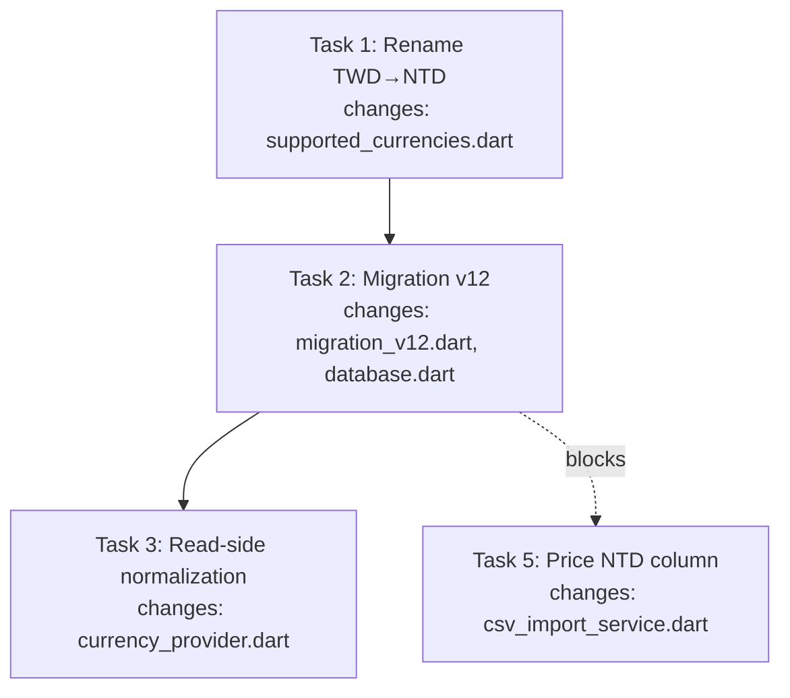

# New feature or fix — full workflow

Drive this work through all 7 steps, in order. Do not skip steps "because it's simple" — the user wants the full pipeline every time. Works for features **and** fixes. Arguments: $ARGUMENTS

Run each step before the next. Pause at the natural checkpoints (after spec, after plan, after issue draft, before PR). State which step you're on as you begin it.

## Peer dependency — superpowers

Invokes `superpowers:brainstorming`, `superpowers:writing-plans`, `superpowers:subagent-driven-development`, `superpowers:test-driven-development`, and `superpowers:finishing-a-development-branch`. Superpowers **must** be installed. If a `superpowers:*` skill is missing, stop and tell the user to install it.

## The hard gate

Steps invoke superpowers skills as sub-steps. Those skills have their **own** handoff instructions (writing-plans → "Execution Handoff"; subagent-driven-development → finishing-a-development-branch; finishing-a-development-branch → local-merge menu). Left unchecked, those handoffs **will** skip or reorder this workflow's steps. The gate prevents that **structurally** — the state file's **Goal status** is the only thing that advances a step.

**Gate check — run at the start of every step:**
1. Read `docs/features/.feature-states/<feat-name>.state.md`.
2. Compare **Goal status** to the status this step requires (table below).
3. Match → proceed. No match → STOP; tell the user the current status and the step it maps to, and resume from there. Do **not** do the current step's work.
4. Set **Goal status** to this step's status *before* the work, so a crash/resume lands back on this step.

Lifecycle: `brainstorm` → `spec` → `planning` → `issue` → `execute` → `pr-review` → `merged`. A step runs only on the immediately preceding status and advances only to the next when done.

| Step | Requires incoming | Sets |
|------|------------------|------|
| 1 brainstorm | _(fresh / no state file)_ | `brainstorm` |
| 2 spec | `brainstorm` | `spec` |
| 3 plan | `spec` | `planning` |
| 4 issue | `planning` | `issue` |
| 5 execute | `issue` | `execute` |
| 6 PR | `execute` | `pr-review` |
| 7 merge | `pr-review` | `merged` |

**Sub-skill handoffs — ignore them; return to the next dev-flow step:**
- `writing-plans` finishes → **step 4 (create issue)**, not its Execution Handoff. The issue must exist first (the branch is named `feature/<n>-<name>` or `fix/<n>-<name>`).
- Execution (step 5) completes → **step 6 (open PR)**, not finishing-a-development-branch's merge menu.
- `subagent-driven-development` → `finishing-a-development-branch` → **stop**, return to step 6. Step 7 is a manual PR merge, not a local merge.
- Gate check fails → STOP and resume from the status the state file names. Don't "helpfully" follow the sub-skill.

The state file is the single source of truth for "what step am I on." On any doubt or ambiguity: run the gate check.

## The state file

Kept so any session can resume and so the gate has something to read. Create in step 1; update on every status change.

- **Location:** `docs/features/.feature-states/<feat-name>.state.md`. The entire `docs/features/` folder is gitignored — never commit. Add it to `.gitignore` on first use if the repo doesn't already.
- **`<feat-name>`**: kebab-case, matching spec/plan filenames and the branch name.

```markdown
# <feat-name> — dev-flow state

- **Created:** YYYY-MM-DD HH:MM
- **Updated:** YYYY-MM-DD HH:MM
- **Base branch:** <branch>
- **Target branch:** <branch>
- **Goal status:** <status>
- **Kind:** feature | fix
- **Last verification:** YYYY-MM-DD HH:MM — <test cmd> <passed|failed>, <lint cmd> <clean|warnings>

## Tasks
- [ ] <task description>

## References
- Spec: docs/features/specs/YYYY-MM-DD-<feat-name>-design.md
- Plan: <path or _(pending)_>
- Issue: <#NN or _(pending)_>
- PR: <#NN or _(pending)_>
```

Rules:
- **Created** — set once in step 1, never changes.
- **Updated** — current timestamp on *every* write.
- **Goal status** — the gate's input; set to the current step *before* the work.
- **Kind** — `feature` or `fix`, set in step 1 from intent. Drives the branch prefix and issue framing. Ambiguous → ask; default `feature`.
- **Last verification** — most recent test + lint result during execute (the repo's commands). The global resume signal — "was it green when I stopped?" `_(not run yet)_` until first run.
- **Tasks** — mirrors the plan's task list as `- [ ]` / `- [x]`; flip on every status change. Live progress; the plan doc is static design.
  - Annotate a task `— ⚠ test failing: <reason>` only when its test exists and is currently red. Don't annotate passing/pending tasks — a `[x]` already means its test passed. Clear when green.
- **References** — spec (step 2), plan (step 3), issue (step 4), PR (step 6). Replace `_(pending)_` with the real value when it exists.

## Resume

If a state file exists for a feat-name, **run the gate check first**: read it, jump to the step matching **Goal status**, reload referenced spec/plan/issue, continue. Don't restart from brainstorm. If it shows `pr-review`, open the PR and stop at the manual merge gate (step 7). No state file → start fresh from step 1.

## Preflight — `docs/features/` is gitignored

Run before step 1, every invocation. The folder holds local-only artifacts and must never reach the remote.

```bash
git check-ignore -q docs/features/ || echo "NOT_IGNORED"
```

`NOT_IGNORED` → add it:
```bash
printf 'docs/features/\n' >> .gitignore
```

If `docs/features/` is already tracked, surface it and stop — don't silently `git rm`. Ask the user. Once gitignored, continue.

## Commit guard — never commit specs, plans, or state

Three local-only artifacts under `docs/features/` (spec, plan, state) must never be committed or pushed.

- After a step writes a file there, spot-check `git check-ignore docs/features/specs/<file>.md` returns the path before moving on.
- In step 5, stage explicitly (`git add <specific files>`), never `git add -A` / `git add .` — guards against leaking if gitignore drifts.
- Before pushing in step 6, confirm `git status --porcelain docs/features/` is empty. If not, stop and fix.

## Step 1 — Brainstorm
**Gate:** fresh start → set `brainstorm`. Create the state file (default base `dev`, target `dev` — target is the PR destination; for `main`-only repos, both are the default branch). Set **Kind** from intent (ask if ambiguous). Invoke `superpowers:brainstorming` to explore intent, requirements, design. Don't write code. Brainstorming will hand off to `writing-plans` — **don't follow it**; advance to step 2.

## Step 2 — Spec (local only)
**Gate:** `brainstorm` → set `spec`. Carry brainstorming's output forward; don't re-derive. Write the design doc to `docs/features/specs/YYYY-MM-DD-<feat-name>-design.md`. Local reference, not published. Add the path to References; show the user. Verify it's gitignored before moving on.

## Step 3 — Plan
**Gate:** `spec` → set `planning`. **Invoke `superpowers:writing-plans` and follow it** — the plan is generated through that skill, not hand-authored. Save to `docs/features/plans/YYYY-MM-DD-<feat-name>.md`. Bite-sized tasks, TDD, frequent commits; reference the spec. Copy the task list into the state file's Tasks; add the plan path to References. Verify it's gitignored. `writing-plans` will offer an Execution Handoff — **don't take it**; advance to step 4.

### Flow chart is mandatory in every plan

The plan **must** include a `## Flow Chart` section, placed right after `## Global Constraints` and before `## File Structure` / the first task. It shows what to do and what changes — task flow plus per-task blast radius — so a reader grasps the whole change at a glance.

Use a Mermaid `flowchart` (renders in VS Code and GitHub). For every task: **what it does** (task name) and **what it changes** (files, keyed to File Structure).

- Each task is a node labeled `Task N: <name>`.
- Connect in execution order with `-->`. Draw a dependency edge where one task blocks another (a later task imports a symbol an earlier task defines) — surfaces the critical path.
- List the files each task touches under its node, e.g. `Task N changes: file_a.dart, file_b.dart`. Never omit the "what changes".
- Add a second diagram for data/control flow (e.g. UI → service → DAO → DB) when the work spans layers. One task-flow chart is the minimum.

Example (adapt, don't copy):


Keep it honest: every task node matches a `### Task N` heading, every file under a node appears in that task's `**Files:**` block. Update the chart in the same edit if a task is added/removed. A stale flow chart is worse than none.

## Step 4 — Create issue
**Gate:** `planning` → set `issue`. Invoke `dev-flow:create-github-issue` to turn the spec + plan into a tracked issue. Draft → user confirms → publish with `gh`; user picks labels. Offer a `feature/<n>-<name>` (or `fix/<n>-<name>`) branch off `dev`; update the state file's base branch and record the issue number in References.

## Step 5 — Execute tasks (TDD)
**Gate:** `issue` → set `execute`. Work task by task via `superpowers:subagent-driven-development` (recommended) or `superpowers:executing-plans`, following `superpowers:test-driven-development`: write the failing test, implement, run it, fix if it fails. Commit per task (Conventional Commits). **Update the state file on every subtask start/complete and every test run:**
- Flip the task's checkbox; bump **Updated**.
- Refresh **Last verification** with the latest test + lint result. A green run clears any `⚠ test failing` annotation.
- Annotate a red task `— ⚠ test failing: <reason>`; clear when green. Leave passing/pending un-annotated.

When `subagent-driven-development` hands off to `finishing-a-development-branch` — **don't run it**; advance to step 6.

## Step 6 — Open PR
**Gate:** `execute` → set `pr-review`. Branch flow `main` → `dev` → `feature/<n>-<name>` (or `fix/...`); PR targets `dev`, never `main`. Push and open with `gh pr create`, body summarizing the issue link, spec, and plan. Record the PR number in References; surface the URL. Do **not** use finishing-a-development-branch's local-merge — step 7 is manual.

## Step 7 — Merge (manual)
**Gate:** `pr-review` → set `merged`. Do not merge. Tell the user the PR is ready for their manual review and merge. On their confirmation, record the final state.

## Notes
- No `dev` branch → fall back to the default base for steps 4 and 6.
- Keep the user in the loop at each checkpoint; this is guided, not fire-and-forget.
- The state file is the source of truth for resuming — keep it honest. A stale state file is worse than none.
- The hard gate is the backbone. If you're doing step N's work while the state file is at a different status, stop and fix the state file first.