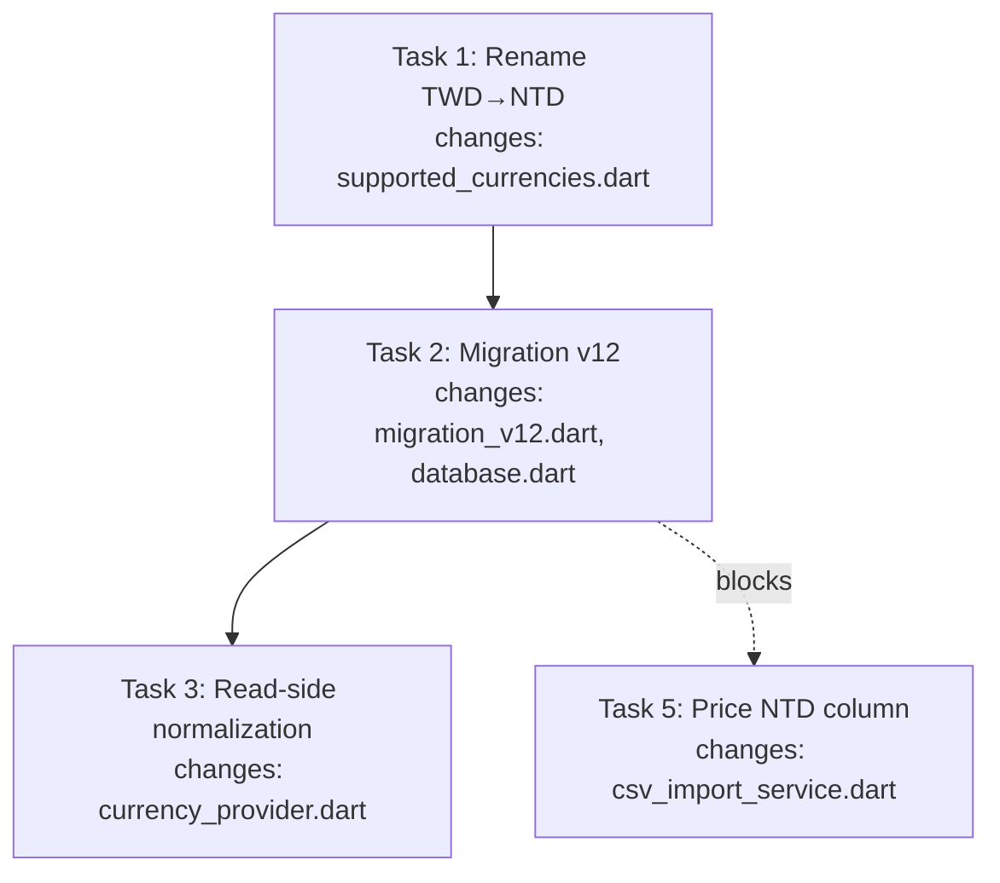

# New feature or fix — full workflow

Drive this work through the complete workflow, in order. Do not skip steps "because it's simple" — the user wants the full pipeline every time. Works for features **and** fixes. Arguments: $ARGUMENTS

Run each step before moving to the next, and pause for the user at the natural checkpoints (after the spec, after the plan, after the issue draft, before the PR). State which step you're on as you begin it.

## Peer dependency — superpowers

This workflow invokes skills from the **superpowers** plugin (`superpowers:brainstorming`, `superpowers:writing-plans`, `superpowers:subagent-driven-development`, `superpowers:test-driven-development`, `superpowers:finishing-a-development-branch`). Superpowers **must** be installed. If a `superpowers:*` skill is missing, stop and tell the user to install the superpowers plugin before continuing.

## The hard gate — why this workflow cannot be skipped

Several steps invoke superpowers skills as sub-steps. Those skills have their **own** "next step" / handoff instructions (e.g. `writing-plans` offers an "Execution Handoff" that jumps straight to executing the plan; `finishing-a-development-branch` offers merge options; `subagent-driven-development` ends by handing off to `finishing-a-development-branch`). Left unchecked, those handoffs **will** skip or reorder this workflow's steps — that is the failure this gate exists to prevent.

The gate is **structural, not prose**: the state file's **Goal status** is the only thing that advances a step, and each step both verifies and updates it. Concretely, every step runs this check on entry:

> **Gate check (run at the start of every step):**
> 1. Read the state file at `docs/features/.feature-states/<feat-name>.state.md`.
> 2. Compare its **Goal status** to the status this step requires (see the lifecycle below).
> 3. If they **match**: proceed with this step.
> 4. If they **do not match**: STOP. You have skipped a step or a sub-skill's handoff is trying to jump ahead. Tell the user which status the file is at and which step that maps to, and resume from there instead. Do **not** do the current step's work.
> 5. Set **Goal status** to this step's status *before* doing the work, so a mid-step crash/resume lands back on this step, not the next one.

The Goal status lifecycle is a strict ordered list — a step may only run when the file is at the **immediately preceding** status, and may only advance to the **next** status when its own work is complete:

`brainstorm` → `spec` → `planning` → `issue` → `execute` → `pr-review` → `merged`

Step → required incoming status → status it sets:
- Step 1 (brainstorm): incoming `_(none / fresh)_` → sets `brainstorm`
- Step 2 (spec): incoming `brainstorm` → sets `spec`
- Step 3 (plan): incoming `spec` → sets `planning`
- Step 4 (issue): incoming `planning` → sets `issue`
- Step 5 (execute): incoming `issue` → sets `execute`
- Step 6 (PR): incoming `execute` → sets `pr-review`
- Step 7 (merge): incoming `pr-review` → sets `merged`

### What this means for sub-skill handoffs

When a sub-skill finishes and presents its own next-step instructions, **ignore them** and return to this workflow's step sequence. Concretely:
- After `superpowers:writing-plans` finishes (step 3), the next action is **step 4 (create issue)** — NOT the plan's "Execution Handoff". The issue must exist before execution because the branch is named `feature/<issue-number>-<name>` (or `fix/<issue-number>-<name>`).
- After execution completes (step 5), the next action is **step 6 (open PR)** — NOT `finishing-a-development-branch`'s merge menu. Merge is step 7 and is manual, by the human.
- After `superpowers:subagent-driven-development` ends by handing off to `superpowers:finishing-a-development-branch`, **stop** — return to step 6 (open PR). Do not run `finishing-a-development-branch`'s local-merge option; this workflow's step 7 is a manual PR merge, not a local merge.
- If the gate check fails at any point, STOP and resume from the status the state file names. Do not "helpfully" continue with what the sub-skill suggested.

The state file is the single source of truth for "what step am I on." On any doubt, resume, or ambiguity: run the gate check and do the step its Goal status names.

## The feature/fix state file

The workflow keeps a **state file** so any session can resume where the last one left off, and so the hard gate has something to read. Create it in step 1 and update it on every status change.

- **Location:** `docs/features/.feature-states/<feat-name>.state.md`. The entire `docs/features/` folder (specs, plans, and states) is gitignored — never commit these files. If a repo doesn't yet gitignore `docs/features/`, add it to `.gitignore` on first use.
- **`<feat-name>`**: kebab-case, matching the name used in spec/plan filenames and the branch name. For a fix, the branch is `fix/<issue-number>-<name>`; for a feature, `feature/<issue-number>-<name>`.

Use this exact template:

```markdown
# <feat-name> — dev-flow state

- **Created:** YYYY-MM-DD HH:MM
- **Updated:** YYYY-MM-DD HH:MM
- **Base branch:** <branch>
- **Target branch:** <branch>
- **Goal status:** <status>
- **Kind:** feature | fix
- **Last verification:** YYYY-MM-DD HH:MM — <test cmd> <passed|failed>, <lint cmd> <clean|warnings>

## Tasks
- [ ] <task description>
- [ ] <task description>

## References
- Spec: docs/features/specs/YYYY-MM-DD-<feat-name>-design.md
- Plan: <path or _(pending)_, removed once plan exists>
- Issue: <#NN or _(pending)_>
- PR: <#NN or _(pending)_>
```

Rules for the state file:
- **Created** is set once in step 1 and never changes.
- **Updated** is rewritten to the current timestamp on *every* write (every status change, every subtask status change, every test-status flip).
- **Goal status** moves through the lifecycle above and is the gate's input. Set it to the step you're currently on *before* doing the work.
- **Kind** is `feature` or `fix`, set in step 1 from the user's intent. It drives the branch prefix (`feature/` vs `fix/`) and issue framing. Ambiguous → ask the user; default to `feature`.
- **Last verification** records the result of the most recent test + lint run during execute (the repo's test/lint commands — e.g. `flutter test`, `pytest`, `npm test`, `cargo test`). Update it whenever you run the suite. This is the global resume signal — "was the whole thing green when I stopped?" Leave it `_(not run yet)_` until the first run.
- **Tasks** mirrors the plan's task list as `- [ ]` / `- [x]` checkboxes. When a subtask's status changes (started, completed, failed-then-fixed), flip its box here. This is the live view of progress; the plan doc is the static design.
  - **Test status** lives inline on the task line, and only when it's *non-trivial* — annotate a task with `— ⚠ test failing: <one-line reason>` when a test for that task exists and is currently red. Do **not** annotate passing or pending tasks; a `[x]` task already implies its test passed, and annotating every line is noise that hides the real signal. Clear the annotation once the test goes green.
- **References** accumulates links as they're created: spec (step 2), plan (step 3), issue (step 4), PR (step 6). Replace each `_(pending)_` with the real path/number when it exists.

## Resume

If a `*.state.md` already exists for a feat-name you're resuming, **run the gate check first**: read the state file, jump to the step matching **Goal status**, reload the referenced spec/plan/issue, and continue. Don't restart from brainstorm. If the user gives a feat-name and the state file shows `pr-review`, open the PR and stop at the manual merge gate (step 7). If no state file exists, start fresh from step 1.

## Preflight — ensure `docs/features/` is gitignored

Run this **before step 1**, on every invocation (fresh or resume). The entire `docs/features/` folder holds local-only artifacts — spec, plan, and state — and must never reach the remote.

```bash
git check-ignore -q docs/features/ || echo "NOT_IGNORED"
```

If it prints `NOT_IGNORED` (or the repo has no `.gitignore` entry covering `docs/features/`), add the folder before proceeding:

```bash
printf 'docs/features/\n' >> .gitignore
```

If `docs/features/` is already tracked (someone committed it earlier), surface that to the user and stop — don't silently `git rm`. Ask whether they want to untrack it. Otherwise, once gitignored, continue to step 1.

## Commit guard — never commit specs, plans, or state

This workflow produces three local-only artifacts under `docs/features/`: the spec, the plan, and the state file. **Never commit or push any of them.** Concretely:

- When the skill you invoke in a step writes a file (the spec in step 2, the plan in step 3, the state file in step 1 and throughout), it lands under `docs/features/`, which the preflight above guarantees is gitignored. Verify this by spot-checking `git check-ignore docs/features/specs/<file>.md` returns the path (i.e. it's ignored) before moving on.
- When you commit task work in step 5, stage explicitly (`git add <specific source files>`), never `git add -A` / `git add .` — the spec/plan/state under `docs/features/` would otherwise ride along if gitignore ever drifts.
- Before pushing the branch in step 6, confirm `git status --porcelain docs/features/` is empty (nothing pending or untracked-leaking there). If it's not, stop and fix before pushing.

## Step 1 — Brainstorm
**Gate:** fresh start (no state file) → set Goal status `brainstorm`. Create the state file with base/target branches (default base `dev`, target `dev` — target is the PR-merge destination; for `main`-only repos, both are the default branch). Set **Kind** from the user's intent (feature vs fix; ask if ambiguous). Invoke the `superpowers:brainstorming` skill to explore intent, requirements, and design with the user. Don't write code in this step. When brainstorming completes, it will try to hand off to `superpowers:writing-plans` — **do not follow that handoff**; return here and advance to step 2.

## Step 2 — Spec (local only)
**Gate:** incoming `brainstorm` → set Goal status `spec`. The spec is the written-up design from step 1's brainstorming — carry that output forward, don't re-derive it. Write the design doc to `docs/features/specs/YYYY-MM-DD-<feat-name>-design.md` (use today's date). This stays local — it is design reference, not a published artifact. Add the spec path to the state file's References. Show the user the doc path when done. Per the commit guard above, verify the file is gitignored before moving on.

## Step 3 — Plan
**Gate:** incoming `spec` → set Goal status `planning`. **You must invoke the `superpowers:writing-plans` skill and follow it** — the plan is generated through that skill, not hand-authored around it. Save the plan it produces to `docs/features/plans/YYYY-MM-DD-<feat-name>.md`. Bite-sized tasks, TDD, frequent commits. The plan should reference the spec. Copy the plan's task list into the state file's Tasks section and add the plan path to References. Per the commit guard above, verify the plan file is gitignored before moving on. When `writing-plans` finishes, it will offer an "Execution Handoff" (subagent-driven or inline) — **do not take it**; return here and advance to step 4.

### Flow chart is mandatory in every plan

The plan **must** include a flow chart section titled `## Flow Chart`, placed right after the `## Global Constraints` block and before `## File Structure` / the first task. It shows **what to do and what is changed** — the task flow plus the per-task blast radius — so a reader can grasp the whole change at a glance without scanning every task body.

Use a Mermaid `flowchart` (Mermaid renders in VS Code and GitHub, the standard for these docs). The chart must convey, for every task: **what it does** (the task name) and **what it changes** (files created/modified, keyed to the File Structure). Concretely:

- Each task is a node labeled `Task N: <name>`.
- Connect tasks in execution order with `-->` arrows. Where one task blocks another (a later task imports a symbol an earlier task defines), draw that dependency edge too — this surfaces the critical path.
- Under each task node (or as a second linked node), list the files it touches, e.g. `Task N changes: file_a.dart, file_b.dart`. The "what is changed" is the point — never omit it.
- If the work has a clear data/control flow (e.g. UI → service → DAO → DB), add a short subgraph or a second diagram showing that flow alongside the task flow. One task-flow chart is the minimum; add the data-flow chart when the work spans layers.

Example shape (adapt to the real work — never copy this verbatim):



After writing the flow chart, keep it honest: every task node must match a `### Task N` heading below, and every file named under a node must appear in that task's `**Files:**` block. If a task is added/removed during self-review, update the chart in the same edit. A stale flow chart is worse than none.

## Step 4 — Create issue
**Gate:** incoming `planning` → set Goal status `issue`. Invoke the `dev-flow:create-github-issue` skill to turn the spec + plan into a tracked GitHub issue. Draft → user confirms → publish with `gh`. User picks labels. Offer a `feature/<issue-number>-<name>` (or `fix/<issue-number>-<name>`) branch off `dev`; update the state file's base branch to the new branch once created, and record the issue number in References.

## Step 5 — Execute tasks (TDD)
**Gate:** incoming `issue` → set Goal status `execute`. Work the plan task by task using `superpowers:subagent-driven-development` (recommended) or `superpowers:executing-plans`, following `superpowers:test-driven-development` for each task: write the failing test, implement, run the test, fix if it fails. Commit per task using Conventional Commits. **Update the state file on every subtask start/complete and every test run:**
- Flip the task's checkbox and bump **Updated**.
- Refresh **Last verification** with the latest test + lint result (the repo's commands). A green run clears any per-task `⚠ test failing` annotation.
- If a task's test is currently red, annotate that task line with `— ⚠ test failing: <one-line reason>`; clear it once green. Leave passing/pending tasks un-annotated.

Keep going until all plan tasks are done and tests pass. When `subagent-driven-development` finishes, it hands off to `superpowers:finishing-a-development-branch` — **do not run that**; return here and advance to step 6.

## Step 6 — Open PR
**Gate:** incoming `execute` → set Goal status `pr-review`. Branch flow is `main` → `dev` → `feature/<issue-number>-<name>` (or `fix/...`); the PR targets `dev`, never `main`. Push the branch and open the PR with `gh pr create`, body summarizing the issue link, spec, and plan. Record the PR number in References. Surface the PR URL to the user. Do **not** use `finishing-a-development-branch`'s local-merge option here — this workflow's merge is manual (step 7).

## Step 7 — Merge (manual)
**Gate:** incoming `pr-review` → set Goal status `merged`. Do not merge. Tell the user the PR is ready for their manual review and merge. Once the user confirms it's merged, record the final state.

## Notes
- If the repo lacks a `dev` branch, fall back to the default base for steps 4 and 6.
- Keep the user in the loop at each checkpoint; this is a guided pipeline, not a fire-and-forget.
- The state file is the source of truth for resuming — keep it honest. A stale state file is worse than none.
- The hard gate is the workflow's backbone. If you ever find yourself doing step N's work while the state file is at a different status, stop and fix the state file first.