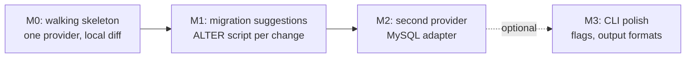

# new-idea

## Overview

Scaffold a structured idea folder for a brainstormed product or concept. Every idea lives under `ideas/[<project>/]<slug>/` and contains a fixed set of five self-contained markdown documents — six if the user opts into cost research (`cost.md`, asked up front) — no ad-hoc file names, no root-level folders.

This is brainstorming output, not code. The result is shareable markdown, so structure and discoverability matter more than anything else. Two of the slots exist to make the folder **buildable**: `cost.md` (when included) captures what the idea costs to run, and `plan.md` is a draft plan the user can hand straight to `/new-feature` when they're ready to build.

**Not a pipeline step.** This skill is standalone (like `document-structure` and `whats-new`) — it runs on demand and never enters the step sequence or the state-file gate. Its output feeds step 1 of `/new-feature` when a later build starts.

## When to use

- User invokes `/new-idea` with an idea description.
- User asks to "create an idea folder for X", "brainstorm X and write it up", "scaffold a doc set for X".
- User asks to "put relevant docs" for a concept in a folder.

## The recipe — produce exactly this

For an idea described as `<X>`, derive a kebab-case English slug `<slug>` and create this tree, nothing else (nesting level and cost opt-in per Rules §1 — shown Case B without cost.md; Case A adds the `<project>` layer, cost opt-in adds `cost.md`):

```
ideas/[<project>/]<slug>/
├── README.md     # overview — the entry point; what the idea is and why
├── research.md   # sources & findings — data, prior art, evidence the idea rests on
├── cost.md       # OPTIONAL (user opt-in) — cost breakdown: pricing, quotas, limits, per-use and monthly totals
├── design.md     # proposed approach — how it works; the design/plan
├── plan.md       # build plan draft — phased tasks, ready to feed /new-feature
└── tl-dr.md      # share-ready summary — a one-screen TL;DR for sharing
```

The five non-cost files are **required slots**; `cost.md` is optional-by-user-choice. Do not rename them, drop one, or invent new ones (`features.md`, `tech-notes.md`, `open-questions.md`, `user-stories.md` are all wrong). Do not create `cost.md` when the user declined it. Map your material into these slots:

| You want to write about… | Put it in |
|---|---|
| The pitch, problem, vision, goals | `README.md` |
| Sources, market data, prior art, comparisons, evidence | `research.md` |
| API pricing, service tiers, quotas, rate limits, hardware costs, monthly totals | `cost.md` — **only if the user opted in (Rules §1)**; otherwise don't create it |
| Architecture, features, scope, non-goals, how it works | `design.md` |
| Phased build order, task breakdown, what to build first | `plan.md` |
| The elevator-pitch version for sharing | `tl-dr.md` |

## Rules

1. **Two questions before anything else.** Before deriving a slug, before any research, ask the user (one AskUserQuestion, two questions, when not already stated):
   - **Where should this idea live?** Propose **project (default)** — Case B: `ideas/<slug>/`, the idea lives in the project's own repo, no project layer. Alternative — **brainstorm only** — Case A: `ideas/<project>/<slug>/`, one ideas repo holds ideas for many projects; project name comes from the user, ask if unclear. The user still confirms; never silently pick one.
   - **Include cost research (`cost.md`)?** Propose **include** (default) — it's what makes the folder buildable and may involve live pricing verification (WebFetch/WebSearch → `curl -sL` → ask user). The user can decline — a purely local/offline idea, or one where pricing simply doesn't matter yet, gets a five-file folder. Never include or skip it silently.
2. **Grill before writing.** Don't turn the first prompt straight into files — discuss the idea with the user first (see the next section). One focused round, a synthesis, an explicit go-ahead — only then create the folder. If the user arrived with a fully-formed brief or says "just write it", skip the grill — never force it on someone who's already decided.
3. **Slug:** lowercase kebab-case English (`expense-tracker`, `db-schema-diff-cli`). No spaces, no underscores, no date prefixes, no Chinese in the folder name.
4. **Files:** the five required slots, plus `cost.md` when the user opted in — every one present, no more. Reuse content the user already provided rather than inventing facts.
5. **Self-contained:** each file stands alone for a reader with no prior context. `tl-dr.md` in particular must be shareable on its own.
6. **Language:** match the repo's default output language (follow the repo's CLAUDE.md / AGENTS.md instruction). Don't force English.
7. **Scratch files are not a source of truth** (e.g. an `options.md`) — ignore scratch material unless the user explicitly points at it.
8. **Extra reference files** (e.g. an `api-links.md` appendix of registration/pricing links) may be added **only** when the user asks for them or the idea clearly needs a link cheat-sheet. They are appendices — they supplement the required slots, never replace one.

## Grill the idea before writing anything

The user's first prompt is a raw idea, not a brief. Turn it into one through discussion **before** creating files — the docs should record the *settled* idea, not open questions you could have resolved in one conversation:

1. **Restate the idea** in one or two sentences — goal, user, rough shape. If you can't state it crisply, that's the first question to ask.
2. **Grill — one focused round.** Challenge the idea where it's weak, in the user's terms:
   - **Who is this for, and what breaks their current workaround?** (the problem behind the idea)
   - **What's the smallest version that proves it?** (scope discipline — kills feature-creep early)
   - **What's the hard part?** (the risky/unknown bit — technical or otherwise)
   - **Why now / why you?** (when it's a product rather than a tool)
   - Ask only the questions whose answers change the docs — 3–6 targeted beats 20 generic. Use AskUserQuestion for the choice-shaped ones (approach A vs B, MVP scope, target user).
3. **Synthesize.** Present what you now believe — the sharpened pitch, the scope that survived the grilling, settled choices, and the open questions that remain. Short and concrete.
4. **Get an explicit go-ahead.** "Write the folder now?" — the user confirms (or redirects) before any file is created. Their corrections from this exchange are the most valuable input the docs will get.

Keep it to one round by default: grill → synthesize → write. If the user wants to iterate more, they'll keep talking — follow their lead. If the synthesis reveals the idea is fundamentally shaky, say so honestly; a folder for a bad idea is not the goal.

### Depth by nesting case

**Outside facts get full treatment; framing gets thin.** In Case B (idea lives in the same repo as the code it would become), the repo already carries the context — write the framing slots short:

- **Thin (orientation only):** `README.md` (problem + goal), `tl-dr.md` (3–5 lines for chat/paste), `design.md` (draft-level — the dev-flow spec will supersede it).
- **Full:** `research.md`, `cost.md`, `plan.md` — external facts and the build draft that exist nowhere else in the repo.

Case A (ideas repo, ideas shared standalone): all slots full — the folder must stand alone for readers with no repo context.

## cost.md — what goes in (only when the user opted in)

This whole section applies **only when the user answered "include" in Rules §1** — if they declined, skip the file entirely and don't do pricing research. Capture what the idea **costs**, grounded only in facts from `research.md` or user input:

- **Per-service pricing** — vendor, tier name, monthly price, and what the tier includes (quota, rate limits, extras like priority support or batch endpoints).
- **Official link per number** — every price and quota row carries its source URL (the vendor's official pricing/docs page, e.g. `https://vendor.com/pricing`). A number without a link is unverified — either add the link or mark it unknown. This keeps numbers checkable and shows readers at a glance what's gone stale. Applies to **both tables**: the per-vendor tier tables (Source column) and the usage-spend table (Sources line under it, one official pricing URL per service).
- **Verify before writing, ask when you can't.** Don't write a number from memory as fact. Verify it live against the official page: try WebFetch/WebSearch first; if they fail (empty results, 404, tool down), fall back to `curl -sL <url>` (cross-platform — macOS, Windows 10+, Linux) and read the returned HTML. Some pages render prices client-side (SPAs) and curl will return no figures. When verification fails, **ask the user for the pricing info** (e.g. "I couldn't verify Cloudflare Workers pricing — can you paste the tier/price?") — they often have a console, invoice, or docs at hand. If the user can't supply it either, mark it `_unverified — check <url>_` or an open question. Never write recall as fact; an honest unknown beats a confident stale number.
- **Consistency with research.md** — source URLs in `cost.md` must match the URLs already recorded in `research.md`; research.md is the single source of truth for links. (If research.md has a typo'd URL, fix it there first.)
- **Full-stack coverage** — cost every service the architecture touches, not just third-party APIs. Pull the complete stack from `design.md`: compute (Cloud Run, Lambda, Vercel…), scheduling/queueing (Cloud Scheduler, Cloud Tasks, cron…), storage (Firestore, S3, Postgres…), and external APIs. Each gets its own pricing rows — an automation tool might have four Google services that are each "basically free" until they're not. Every service named in `design.md`/`plan.md` appears in `cost.md`, even if just to say $0 / no cost.
- **Free options** — call/req/day limits, and what breaks when you exceed them.
- **Overage / per-use costs** — per-credit or per-request pricing above quota.
- **Hardware / one-off costs** — device, board, or setup costs, when the idea is physical.
- **Recommended path** — the cheapest viable starting point, and when it makes sense to upgrade.
- **Usage-based spend — daily AND monthly, per scenario, across the whole stack.** Tier prices alone don't say what the idea costs to run. Project actual spend at usage levels (e.g. light / typical / heavy): estimate per-service usage per day, then show **cost/day** and **cost/month** (30-day month) per service **and totaled**. Flat-monthly services show a flat row (`$29/mo = flat`). The scenarios often reveal **pivot points** — usage levels where a free-tier architecture stops being free (Firestore writes, Run request counts) and the cheapest path changes; call those out explicitly ("free up to ~N/day, then Cloud Run requests dominate"). A $0-total at every level is itself a finding — say it. Example shape for a stack (automation tool: Cloud Scheduler → Cloud Tasks → Cloud Run → Firestore + a weather API):

  ```markdown
  | Scenario | Scheduler | Tasks | Cloud Run | Firestore | Weather API | Total/day | Total/month |
  |---|---|---|---|---|---|---|---|
  | Light (1 city, hourly) | $0 | $0 | $0 | $0 | $0 | $0 | $0 |
  | Typical (50 cities, hourly) | $0 | $0 | $0 | ~$0.05 | $0 | ~$0.05 | ~$1.50 |
  | Heavy (500 cities, every 10 min) | ~$0.10 | $0 | ~$0.40 | ~$0.60 | $0 | ~$1.10 | ~$33 |

  Sources: Cloud Scheduler https://cloud.google.com/scheduler/pricing · Cloud Tasks https://cloud.google.com/tasks/pricing · Cloud Run https://cloud.google.com/run/pricing · Firestore https://cloud.google.com/firestore/pricing · Weather API https://open-meteo.com/en/docs
  ```

  (Figures illustrative — derive them from the verified tier tables above. Every column's price basis comes from that service's tier table, which carries the official link — the **Sources line repeats each service's official pricing URL** so the spend table stands alone when shared. Pivot points to call out: Firestore writes exhaust their free tier around Typical; Cloud Run request-minutes dominate at Heavy.)

- **Show the calculation, not just the result.** Every cost cell must be traceable: show the arithmetic in a "How" note, a per-scenario breakdown, or inline — `2,000 calls × $0.002/call = $4.00/day`, `(10,000 − 1,000 free) × $0.002 = $18/day`, `within Free 1,000/day → $0`. A reader must be able to re-derive every number from the tier tables + the usage estimate without trusting you. A result with no shown math is an assumption hiding as a fact.
- **Unknowns** — mark anything unpriced as an open question; never invent a number.

A small table per vendor (with a Source column for the official link) **plus the usage-spend table** plus a one-line recommendation is the right shape:

```markdown
| Tier | Price | Includes | Source |
|---|---|---|---|
| Free | $0/mo | 1,000 calls/mo, 100 req/day | https://vendor.com/pricing |
| Starter | $19/mo | 10,000 calls/mo, 100 items/req | https://vendor.com/pricing |
```

If the idea genuinely has no running costs, write one line saying so — the slot still gets a file (when opted in). If the user declined `cost.md`, don't create the file at all — record pricing unknowns as open questions in `research.md` instead.

## plan.md — the /new-feature draft

A phased build plan the user can paste into `/new-feature` when ready to build. Shape it as:

- **Milestone 0 — walking skeleton:** the thinnest end-to-end slice that proves the idea works (one input → one output, no polish).
- **Milestones 1..n:** one milestone per coherent user-visible increment, each small enough to finish in a sitting. For each milestone: goal, the tasks within it (short imperative bullets), and what "done" looks like.
- **A milestone flow diagram** — a simple Mermaid `flowchart` right after the milestone list, showing build order at a glance (one node per milestone, `-->` in sequence, `-.->` for optional/spawned-later paths). Keep it small — the full task-level Flow Chart comes later in `/new-feature`'s plan; this one is the draft-level overview:



- **Explicit non-goals** — carried over from `design.md`.
- **Open questions** that would change the plan if answered differently.

Keep it a **draft**, not a full dev-flow plan: no test files, no branch names, no issue numbers. `/new-feature` runs its own brainstorm → spec → plan steps and will refine this — `plan.md` is the input that makes those steps fast, not a replacement for them. Its milestone diagram seeds step 3's mandatory task-level Flow Chart. Every task must trace back to something in `design.md`; if a task has no design behind it, the design is missing a section — fix `design.md`, not the plan.

## Example

`/new-idea create an idea folder for a CLI tool that diffs two database schemas and suggests migrations`

(User confirms: ideas repo, project `db-tools`.) Produces:

```
ideas/db-tools/db-schema-diff-cli/
├── README.md     # the problem (schema drift), vision, design principles
├── research.md   # existing tool comparison (prisma migrate, liquibase), sources
├── cost.md       # per-DB-provider connection costs (mostly $0 — local CLI), maintenance
├── design.md     # MVP scope, CLI flags, provider architecture, non-goals
├── plan.md       # Milestone 0: one provider diff locally → one more provider per milestone
└── tl-dr.md      # one-paragraph shareable summary
```

Sample of the filled-in depth expected — `cost.md` (with source links) and `plan.md` (with the milestone diagram):

> **cost.md** (excerpt)
>
> ```markdown
> ## Running costs
>
> The CLI is local — no paid services. Per-provider connection needs:
>
> | Provider | Cost | Includes | Source |
> |---|---|---|---|
> | PostgreSQL | $0 | direct connection; CLI needs a read-only user | https://www.postgresql.org/docs/current/app-psql.html |
> | MySQL | $0 | direct connection | https://dev.mysql.com/doc/ |
> | Hosted DB (e.g. Supabase free tier) | $0–$25/mo | free tier: 500 MB, pauses on inactivity | https://supabase.com/pricing |
>
> **Recommended path:** start with $0 direct connections; only a hosted test DB would add cost.
> Open question: license cost if we ever ship a GUI wrapper — unknown, not priced.
> ```

> **plan.md** (excerpt)
>
> ```markdown
> ## Milestones
>
> **M0 — walking skeleton.** Goal: `db-schema-diff postgres A B` prints raw table/column diff. Done: two local Postgres schemas diff end-to-end.
> - Scaffold CLI entrypoint
> - Introspect one provider (Postgres) to normalized schema model
> - Print diff of two snapshots
>
> **M1 — migration suggestions.** Goal: diff output includes a suggested `ALTER` script per change. Done: dropping a column suggests the right `ALTER TABLE`.
> - Map diff hunks to migration templates
> - Render SQL script
>
> **M2 — second provider.** Goal: same flow works on MySQL. Done: cross-provider diff via normalized model.
> - MySQL introspection adapter
> - Provider detection from connection string
>
> ## Flow
> (mermaid diagram as specified above)
>
> ## Non-goals
> Carried from design.md: no auto-applying migrations; no cloud sync.
>
> ## Open questions
> - Do we need cross-provider type mapping tables (Postgres↔MySQL), or is within-provider diff enough for v1?
> ```

If the user supplies specifics (a name, target audience, constraints), fold them into the matching file rather than overriding the structure.

## Handoff to /new-feature

When the folder is complete, tell the user:

> Idea folder ready: `ideas/[<project>/]<slug>/` (5 files, or 6 with `cost.md`). When you're ready to build, run `/new-feature ideas/<project>/<slug>` (Case B: `ideas/<slug>`) — step 1 reads the folder's docs as its brief.

## Common mistakes

- **Folder in project root** instead of `ideas/`. Always nest.
- **Writing straight from the first prompt.** The user gave you a raw idea — grill it (one round), synthesize, get an explicit go-ahead before creating files. The docs record the settled idea, not the first draft of it. Equally wrong: forcing the grill on a user who arrived decided or said "just write it".
- **Silently picking a nesting level or cost inclusion.** Ask both questions up front (Rules §1) — they're the user's call, not an inference. Creating `cost.md` after a decline is as wrong as omitting it after an opt-in.
- **Inventing file names** (`features.md`, `tech-notes.md`). Use the fixed files — map your content into them.
- **Dropping `tl-dr.md`** because "the idea isn't fleshed out yet." Write a short summary anyway; it's a required slot.
- **Wrong language** — writing English when the repo's default is another language. Match the repo language.
- **Inventing prices or quotas in `cost.md`.** Every number must come from `research.md`, a user-provided source, or be marked unknown — and carries its official source URL.
- **Writing memory as verified.** "I know this API costs $29/mo" is not verification. If WebFetch/WebSearch and `curl` can't confirm the number live, ask the user for the pricing info — and if they can't supply it, mark it `_unverified_`. Don't present recall as fact.
- **Result without math.** A spend table showing only dollar totals isn't checkable — show the calculation per cell or the table is asserting, not arguing.
- **Cost blind spots.** A service named in `plan.md` but missing from `cost.md` (even at $0) leaves a gap — the reader assumes it was priced and found free, when actually it was forgotten.
- **Writing a full dev-flow plan in `plan.md`** — branches, tests, issue refs. Keep it a milestone/task draft; `/new-feature` does the rest.
- **Filling files with invented facts** when the brief is thin. Stay grounded in what the user gave you; mark genuine unknowns as open questions inside the relevant file instead of fabricating.